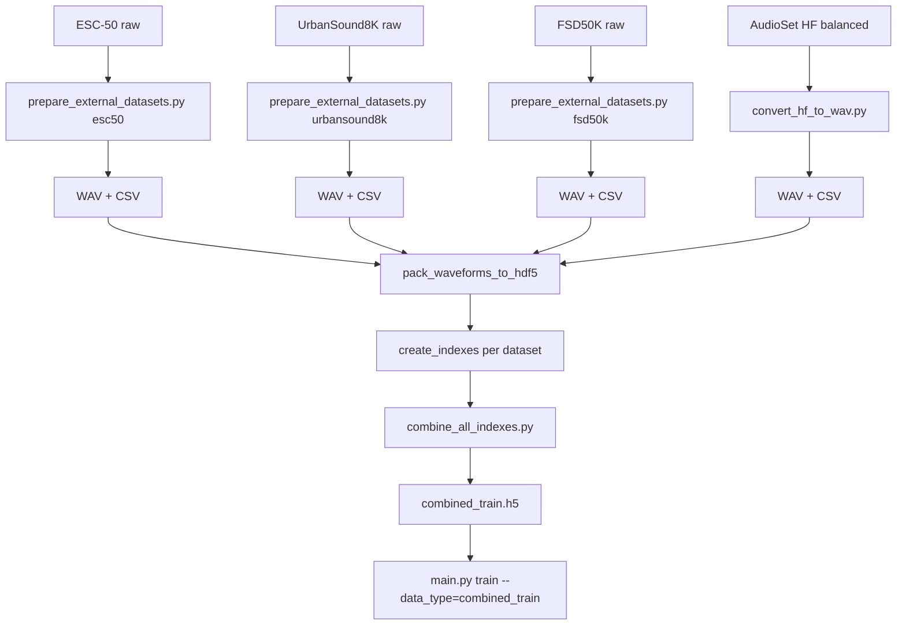

# Multi-Dataset Training Pipeline — Walkthrough

## What was built

Three deliverables to integrate ESC-50, FSD50K, and UrbanSound8K with AudioSet for CNN14 training at 16 kHz:

### 1. [prepare_external_datasets.py](file:///home/ankur/projects/audioset_tagging_cnn/scripts/prepare_external_datasets.py)

**Sub-commands:** [esc50](file:///home/ankur/projects/audioset_tagging_cnn/scripts/prepare_external_datasets.py#182-265), [fsd50k](file:///home/ankur/projects/audioset_tagging_cnn/scripts/prepare_external_datasets.py#378-494), [urbansound8k](file:///home/ankur/projects/audioset_tagging_cnn/scripts/prepare_external_datasets.py#291-373)

Each sub-command:
- Reads the dataset's native metadata format
- Maps labels → AudioSet 527-class MIDs (ESC-50: 50→49 mapped, UrbanSound8K: 10→10, FSD50K: uses MIDs natively)
- Resamples to 16 kHz mono, pads/truncates to 10 s
- Writes `Y<id>.wav` + AudioSet-format CSV

### 2. [combine_all_indexes.py](file:///home/ankur/projects/audioset_tagging_cnn/scripts/combine_all_indexes.py)

Merges multiple index HDF5 files into one `combined_train.h5`. Validates `classes_num` matches across all inputs.

### 3. [TRAINING_GUIDE.md](file:///home/ankur/projects/audioset_tagging_cnn/TRAINING_GUIDE.md) — Section 12

New section with step-by-step commands for downloading, preparing, packing, indexing, combining, and training.

## End-to-end workflow

## Verification

- Both Python scripts pass AST syntax validation (no syntax errors)
- No changes to existing training code — fully additive approach
- The combined index uses the exact same HDF5 schema as [create_indexes.py](file:///home/ankur/projects/audioset_tagging_cnn/utils/create_indexes.py)
- Full end-to-end test requires downloading the actual external datasets
