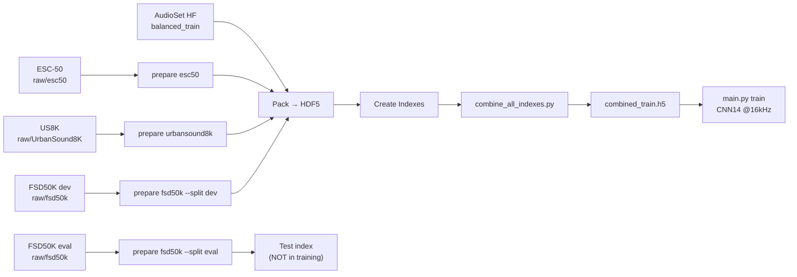

# Step-by-Step Guide: Training CNN14 with Combined Data

This guide walks you through the full pipeline to train CNN14 at 16 kHz using AudioSet (HuggingFace) + ESC-50 + FSD50K + UrbanSound8K.

> [!IMPORTANT]
> FSD50K eval split is used for **testing only** and is excluded from the training index.

---

## Prerequisites

```bash
pip install datasets huggingface_hub scipy librosa soundfile h5py
```

---

## Step 1: Prepare AudioSet (HuggingFace)

```bash
python scripts/convert_hf_to_wav.py \
    --dataset_dir ./datasets/audioset
```

This downloads AudioSet balanced train + eval from HuggingFace and writes:

- `datasets/audioset/audios/balanced_train_segments/Y*.wav`
- `datasets/audioset/audios/eval_segments/Y*.wav`
- `datasets/audioset/metadata/*.csv`

---

## Step 2: Download FSD50K Ground Truth

Your FSD50K audio is in `raw/fsd50k/` but the ground truth CSV files are required.
Download `FSD50K.ground_truth.zip` from [Zenodo](https://zenodo.org/record/4060432) and extract into `raw/fsd50k/`:

```
raw/fsd50k/
├── FSD50K.ground_truth/     ← extract here
│   ├── dev.csv
│   └── eval.csv
├── FSD50K.metadata/         ← already present
├── dev_audio/               ← already present
└── eval_audio/              ← already present
```

---

## Step 3: Prepare External Datasets

```bash
# ESC-50 (~2,000 clips)
python scripts/prepare_external_datasets.py esc50 \
    --dataset_dir ./raw/esc50/ESC-50-master \
    --output_dir  ./datasets/esc50

# UrbanSound8K (~8,700 clips)
python scripts/prepare_external_datasets.py urbansound8k \
    --dataset_dir ./raw/UrbanSound8K \
    --output_dir  ./datasets/urbansound8k

# FSD50K dev → training data, eval → test data (separate CSVs)
python scripts/prepare_external_datasets.py fsd50k \
    --dataset_dir ./raw/fsd50k \
    --output_dir  ./datasets/fsd50k \
    --split all
```

Output per dataset:

- `datasets/<name>/audios/Y*.wav` — 16 kHz, mono, 10s WAVs
- `datasets/<name>/metadata/*_train.csv` — AudioSet-format CSV
- `datasets/fsd50k/metadata/fsd50k_eval.csv` — FSD50K eval (test only)

---

## Step 4: Pack Waveforms → HDF5

> [!TIP]
> The packer now uses **multiprocessing** and **soundfile** for ~5-8x speedup.
> `--sample_rate=16000` packs at native 16 kHz (160k samples/clip) — no unnecessary resampling.
> `--num_workers` defaults to your CPU count.

```bash
WORKSPACE="./workspaces/audioset_tagging"

# AudioSet balanced train
python3 utils/dataset.py pack_waveforms_to_hdf5 \
    --csv_path=./datasets/audioset/metadata/balanced_train_segments.csv \
    --audios_dir=./datasets/audioset/audios/balanced_train_segments \
    --waveforms_hdf5_path="$WORKSPACE/hdf5s/waveforms/balanced_train.h5" \
    --sample_rate=16000

# AudioSet eval (for validation)
python3 utils/dataset.py pack_waveforms_to_hdf5 \
    --csv_path=./datasets/audioset/metadata/eval_segments.csv \
    --audios_dir=./datasets/audioset/audios/eval_segments \
    --waveforms_hdf5_path="$WORKSPACE/hdf5s/waveforms/eval.h5" \
    --sample_rate=16000

# ESC-50
python3 utils/dataset.py pack_waveforms_to_hdf5 \
    --csv_path=./datasets/esc50/metadata/esc50_train.csv \
    --audios_dir=./datasets/esc50/audios \
    --waveforms_hdf5_path="$WORKSPACE/hdf5s/waveforms/esc50.h5" \
    --sample_rate=16000

# UrbanSound8K
python3 utils/dataset.py pack_waveforms_to_hdf5 \
    --csv_path=./datasets/urbansound8k/metadata/urbansound8k_train.csv \
    --audios_dir=./datasets/urbansound8k/audios \
    --waveforms_hdf5_path="$WORKSPACE/hdf5s/waveforms/urbansound8k.h5" \
    --sample_rate=16000

# FSD50K training (dev split only)
python3 utils/dataset.py pack_waveforms_to_hdf5 \
    --csv_path=./datasets/fsd50k/metadata/fsd50k_train.csv \
    --audios_dir=./datasets/fsd50k/audios \
    --waveforms_hdf5_path="$WORKSPACE/hdf5s/waveforms/fsd50k_train.h5" \
    --sample_rate=16000

# FSD50K eval (test only — NOT added to training)
python3 utils/dataset.py pack_waveforms_to_hdf5 \
    --csv_path=./datasets/fsd50k/metadata/fsd50k_eval.csv \
    --audios_dir=./datasets/fsd50k/audios \
    --waveforms_hdf5_path="$WORKSPACE/hdf5s/waveforms/fsd50k_eval.h5" \
    --sample_rate=16000
```

---

## Step 5: Create Indexes

```bash
# Training indexes
for dset in balanced_train esc50 urbansound8k fsd50k_train; do
    python3 utils/create_indexes.py create_indexes \
        --waveforms_hdf5_path="$WORKSPACE/hdf5s/waveforms/${dset}.h5" \
        --indexes_hdf5_path="$WORKSPACE/hdf5s/indexes/${dset}.h5"
done

# Eval/test indexes (not for training)
for dset in eval fsd50k_eval; do
    python3 utils/create_indexes.py create_indexes \
        --waveforms_hdf5_path="$WORKSPACE/hdf5s/waveforms/${dset}.h5" \
        --indexes_hdf5_path="$WORKSPACE/hdf5s/indexes/${dset}.h5"
done
```

---

## Step 6: Combine Training Indexes

```bash
python scripts/combine_all_indexes.py \
    --indexes \
        "$WORKSPACE/hdf5s/indexes/balanced_train.h5" \
        "$WORKSPACE/hdf5s/indexes/esc50.h5" \
        "$WORKSPACE/hdf5s/indexes/urbansound8k.h5" \
        "$WORKSPACE/hdf5s/indexes/fsd50k_train.h5" \
    --output \
        "$WORKSPACE/hdf5s/indexes/combined_train.h5"
```

> [!NOTE]
> FSD50K eval is intentionally **excluded** from the combined training index.
> Use `$WORKSPACE/hdf5s/indexes/fsd50k_eval.h5` separately for testing.

---

## Step 7: Train CNN14

```bash
CUDA_VISIBLE_DEVICES=0 python3 pytorch/main.py train \
    --workspace="./workspaces/audioset_tagging" \
    --data_type='combined_train' \
    --sample_rate=16000 \
    --window_size=512 \
    --hop_size=160 \
    --mel_bins=64 \
    --fmin=50 \
    --fmax=8000 \
    --model_type='Cnn14' \
    --loss_type='clip_bce' \
    --balanced='balanced' \
    --augmentation='mixup' \
    --batch_size=32 \
    --learning_rate=1e-3 \
    --resume_iteration=0 \
    --early_stop=600000 \
    --cuda
```

> [!NOTE]
> `window_size=512`, `hop_size=160` are the 16 kHz equivalents of 1024/320 at 32 kHz.
> `fmax=8000` because Nyquist at 16 kHz is 8 kHz.

---

## Summary of Data Flow



---

## Expected Dataset Sizes

| Dataset            | Clips       | Classes mapped |
| ------------------ | ----------- | -------------- |
| AudioSet balanced  | ~22,000     | 527            |
| ESC-50             | ~1,960      | 49 of 50       |
| UrbanSound8K       | ~8,700      | 10             |
| FSD50K dev (train) | ~40,000     | ~200           |
| **Combined total** | **~72,660** | —              |
| FSD50K eval (test) | ~10,000     | ~200           |
